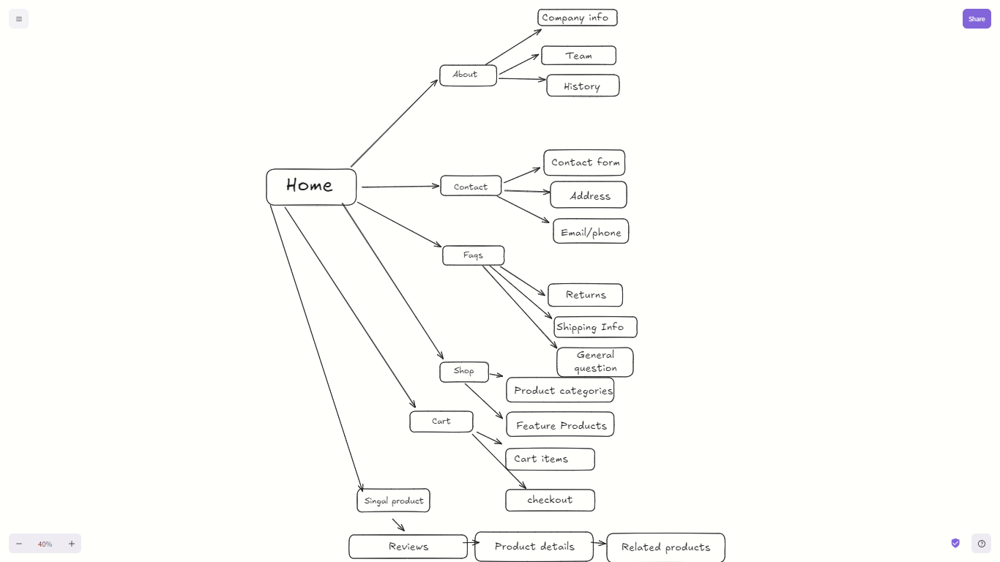

# Comforty

### Table of Contents

1. [Project Overview](#project-overview)
2. [System Architecture](#system-architecture)
3. [Schemas](#schemas)
4. [API Endpoints](#api-endpoints)
5. [CMS Integration](#cms-integration)

---

## Project Overview

**Comforty** is a fully functional e-commerce marketplace targeting the furniture market. This platform specializes in selling sofas, tables, beds, and other furniture-related items, offering a seamless shopping experience to users.


---

## System Architecture

Provide a high-level overview of the system's architecture. Include a diagram to visualize the interactions between components like the frontend, backend, database, and third-party services.



---

## Schemas

Define the database schemas used in the Comforty marketplace. Below is an example schema for the product model:

### Product Schema

```json
{
  "id": "string",
  "name": "string",
  "description": "string",
  "price": "number",
  "category": "string",
  "images": ["string"],
  "stock": "number",
  "createdAt": "date",
  "updatedAt": "date"
}
```

### User Schema

```json
{
  "id": "string",
  "name": "string",
  "email": "string",
  "password": "string",
  "address": "string",
  "role": "string",
  "createdAt": "date",
  "updatedAt": "date"
}
```

### ShipEngine Schema

```json
{
  "shipmentId": "string",
  "carrier": "string",
  "trackingNumber": "string",
  "status": "string",
  "estimatedDeliveryDate": "date",
  "createdAt": "date",
  "updatedAt": "date"
}
```

### Category Schema

```json
{
  "slug": "string",
  "title": "string",
  "description": "string",
  "createdAt": "date",
  "updatedAt": "date"
}
```

### Coupon Schema

```json
{
  "couponId": "string",
  "code": "string",
  "discount": "number",
  "validFrom": "date",
  "validUntil": "date",
  "isActive": "boolean",
  "createdAt": "date",
  "updatedAt": "date"
}
```

### Chair Product Schema

```json
{
  "id": "string",
  "name": "string",
  "description": "string",
  "price": "number",
  "category": "string",
  "isFeaturedProduct": "boolean",
  "isBestSeller": "boolean",
  "tags":"Array" | "Object",
  "image": "image",
  "stock": "number",
  "createdAt": "datetime",
  "updatedAt": "datetime"
}
```

---


## API Endpoints

Detail the API endpoints that support the functionality of Comforty. Below are some examples:

### Authentication Endpoints

- **POST** `/api/auth/register` - Register a new user
- **POST** `/api/auth/login` - Log in a user

### Product Endpoints

- **GET** `/api/products` - Fetch all products
- **POST** `/api/products` - Add a new product (Admin only)
- **GET** `/api/products/:id` - Fetch a product by ID

### Order Endpoints

- **POST** `/api/orders` - Create a new order
- **GET** `/api/orders` - Fetch all orders for a user

---

## Sanity CMS Integration

Explain how the Content Management System (CMS) integrates with Comforty. Highlight the role of the CMS in managing content like product descriptions, blog posts, or promotional banners.

Feel free to fill in the placeholders with actual images, URLs, and additional information as your project develops!
